## Journal articles

|        |  |
|   :-:    | -       |
| 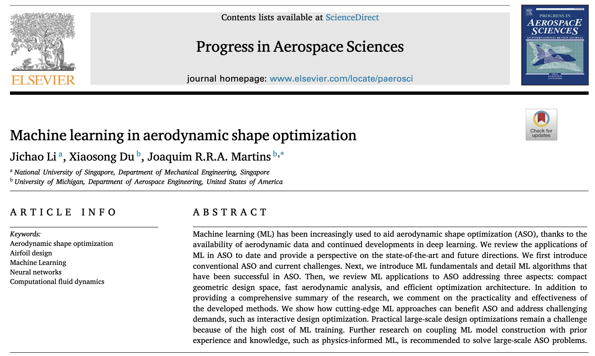 | __Jichao Li__, Xiaosong Du, Joaquim R. R. A. Martins.     [__Machine learning in aerodynamic shape optimization__](https://www.researchgate.net/publication/363208636_Machine_learning_in_aerodynamic_shape_optimization)     _Progress in Aerospace Sciences_ (2022)|
| 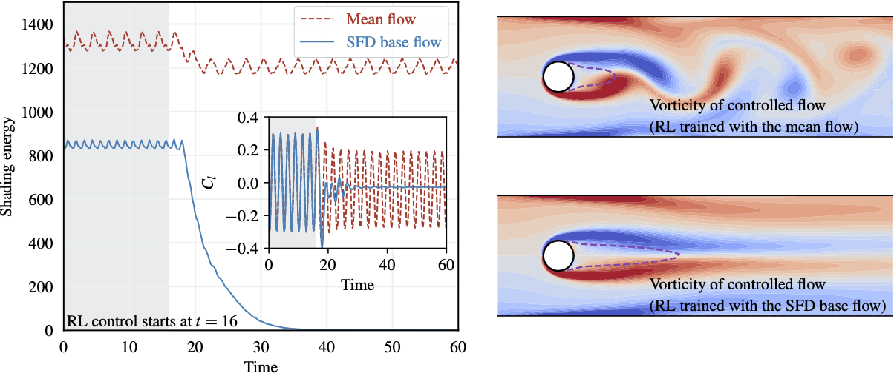 | __Jichao Li__, Mengqi Zhang.     [__Reinforcement-learning-based Control of Confined Cylinder Wakes with Stability Analyses__](https://www.researchgate.net/publication/357030368_Reinforcement-learning-based_control_of_confined_cylinder_wakes_with_stability_analyses)     _Journal of Fluid Mechanics_ (2022)|
| 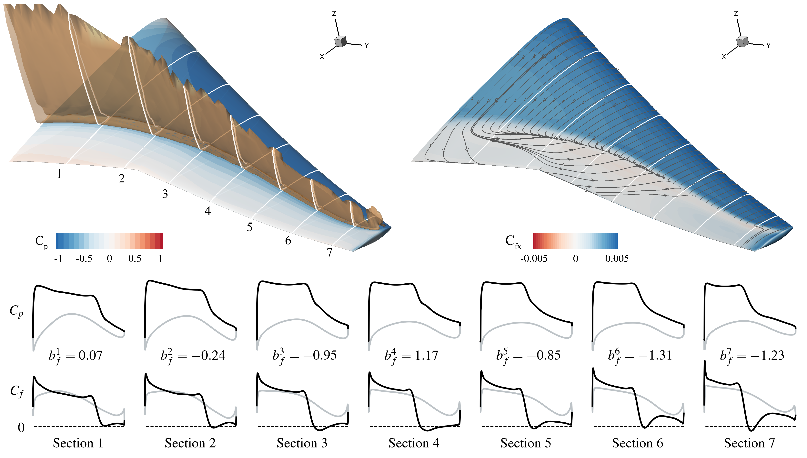 | __Jichao Li__, Sicheng He, Mengqi Zhang, Joaquim R. R. A. Martins, Boo Cheong Khoo.     [__Physics-Based Data-Driven Buffet-Onset Constraint for Aerodynamic Shape Optimization__](https://www.researchgate.net/publication/360621247_Physics-Based_Data-Driven_Buffet-Onset_Constraint_for_Aerodynamic_Shape_Optimization)     _AIAA Journal_ (2022)|
| 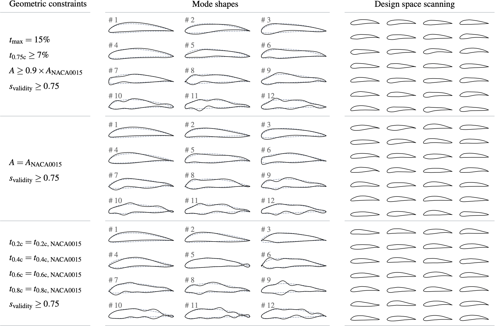 | __Jichao Li__, Mengqi Zhang, Chien Ming Jonathan Tay, Ningyu Liu, Yongdong Cui, Siou Chye Chew, Boo Cheong Khoo.     [__Low-Reynolds-number Airfoil Design Optimization using Deep-learning-based Tailored Airfoil Modes__](https://www.researchgate.net/publication/357441176_Low-Reynolds-number_airfoil_design_optimization_using_deep-learning-based_tailored_airfoil_modes)     _Aerospace Science and Technology_ (2022)|
| 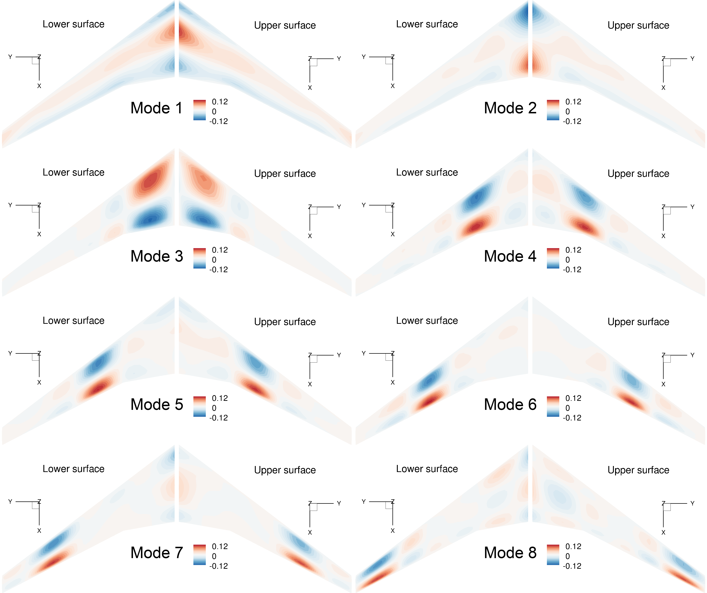 | __Jichao Li__, Mengqi Zhang.     [__Adjoint-Free Aerodynamic Shape Optimization of the Common Research Model Wing__](https://www.researchgate.net/publication/348646137_Adjoint-Free_Aerodynamic_Shape_Optimization_of_the_Common_Research_Model_Wing)     _AIAA Journal_ (2021)|
| 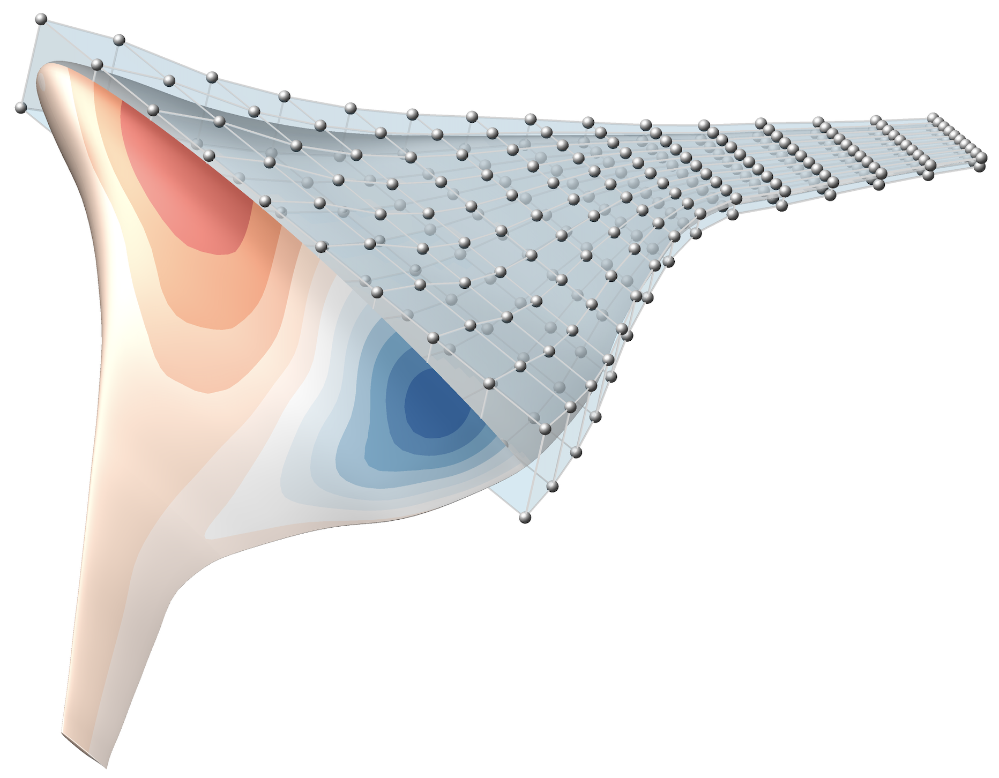 | __Jichao Li__, Mengqi Zhang.     [__On deep-learning-based geometric filtering in aerodynamic shape optimization__](https://www.researchgate.net/publication/349656275_On_deep-learning-based_geometric_filtering_in_aerodynamic_shape_optimization)     _Aerospace Science and Technology_ (2021)|
|  | __Jichao Li__, Mengqi Zhang.     [__Data-based Approach for Wing Shape Design Optimization__](https://www.researchgate.net/publication/350161199_Data-based_approach_for_wing_shape_design_optimization)     _Aerospace Science and Technology_ (2021)|
| 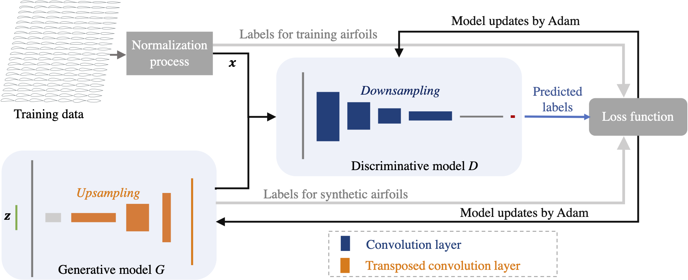 | __Jichao Li__, Mengqi Zhang, Joaquim R. R. A. Martins, Chang Shu.     [__Efficient Aerodynamic Shape Optimization with Deep-Learning-Based Geometric Filtering__](https://www.researchgate.net/publication/342620657_Efficient_Aerodynamic_Shape_Optimization_with_Deep-Learning-Based_Geometric_Filtering)     _AIAA Journal_ (2020)|
| 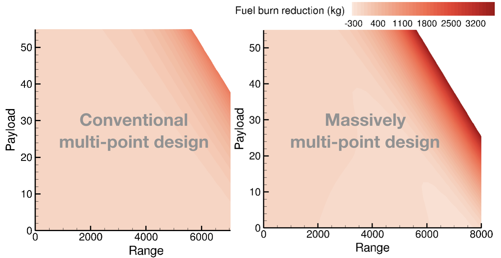 | __Jichao Li__, Jinsheng Cai.     [__Massively Multipoint Aerodynamic Shape Design via Surrogate-Assisted Gradient-Based Optimization__](https://www.researchgate.net/publication/338232729_Massively_Multipoint_Aerodynamic_Shape_Design_via_Surrogate-Assisted_Gradient-Based_Optimization)     _AIAA Journal_ (2020)|
| 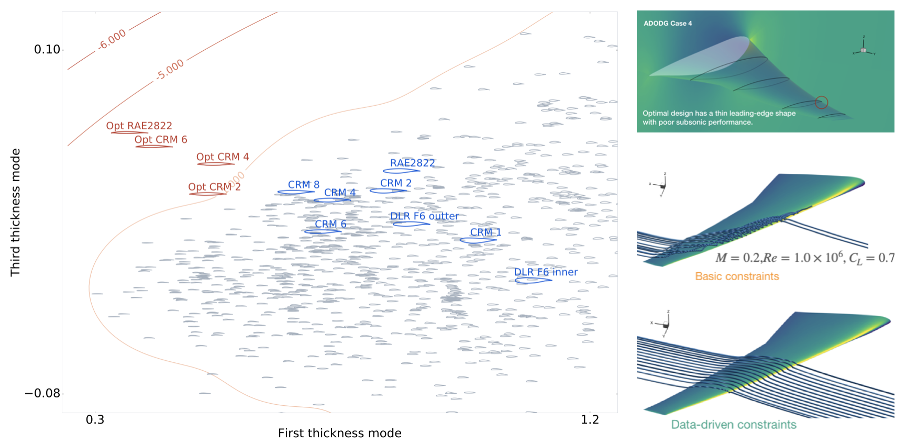 | __Jichao Li__, Sicheng He, Joaquim R. R. A. Martins.     [__Data-driven Constraint Approach to Ensure Low-speed Performance in Transonic Aerodynamic Shape Optimization__](https://www.researchgate.net/publication/333761028_Data-driven_Constraint_Approach_to_Ensure_Low-speed_Performance_in_Transonic_Aerodynamic_Shape_Optimization)     _Aerospace Science and Technology_ (2019)|
| 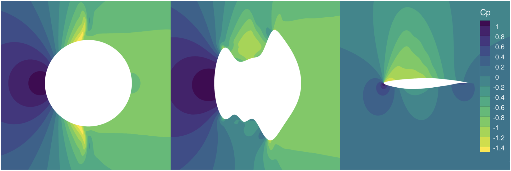 | Xiaolong He, __Jichao Li__, Charles Mader, Anil Yildirim, Joaquim R. R. A. Martins.     [__Robust aerodynamic shape optimization—From a circle to an airfoil__](https://www.researchgate.net/publication/331027606_Robust_aerodynamic_shape_optimization-From_a_circle_to_an_airfoil)     _Aerospace Science and Technology_ (2019)|
| 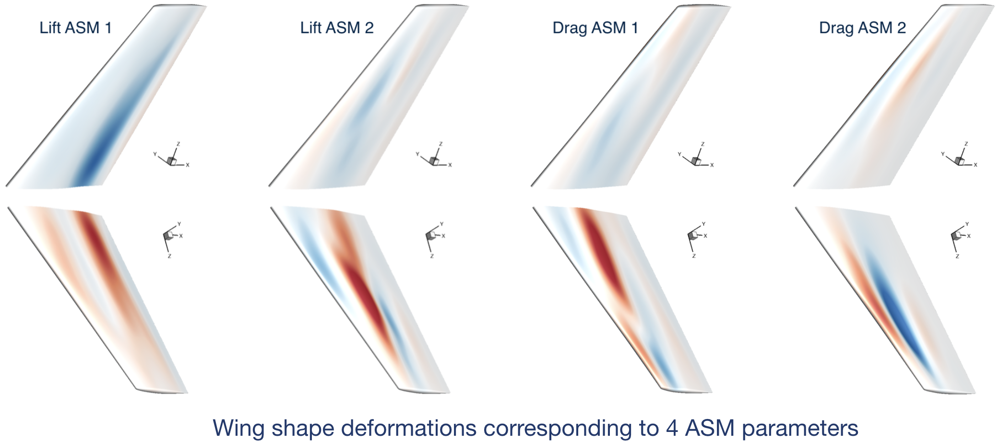 | __Jichao Li__, Jinsheng Cai, Kun Qu.     [__Surrogate-based aerodynamic shape optimization with the active subspace method__](https://www.researchgate.net/publication/327211575_Surrogate-based_aerodynamic_shape_optimization_with_the_active_subspace_method)     _Structural and Multidisciplinary Optimization_ (2019)|
| 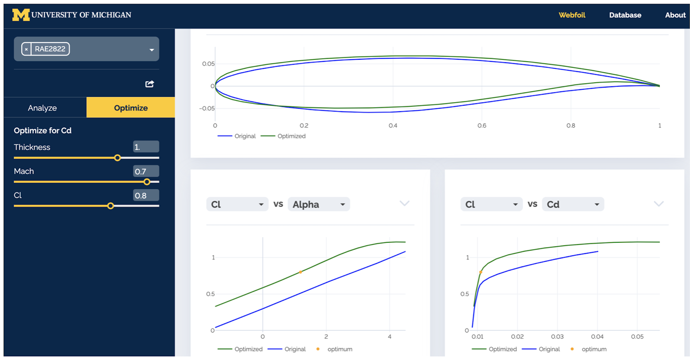 | __Jichao Li__, Mohamed A. Bouhlel, Joaquim R. R. A. Martins.     [__Data-Based Approach for Fast Airfoil Analysis and Optimization__](https://www.researchgate.net/publication/328713133_Data-Based_Approach_for_Fast_Airfoil_Analysis_and_Optimization)     _AIAA Journal_ (2019)|
|  | __Jichao Li__, Jinsheng Cai, Kun Qu.     [__Adjoint-Based Two-Step Optimization Method Using Proper Orthogonal Decomposition and Domain Decomposition__](https://arc.aiaa.org/doi/10.2514/1.J055773)     _AIAA Journal_ (2018)|

## Conference proceedings

|        |  |
|   :-:    | -       |
| 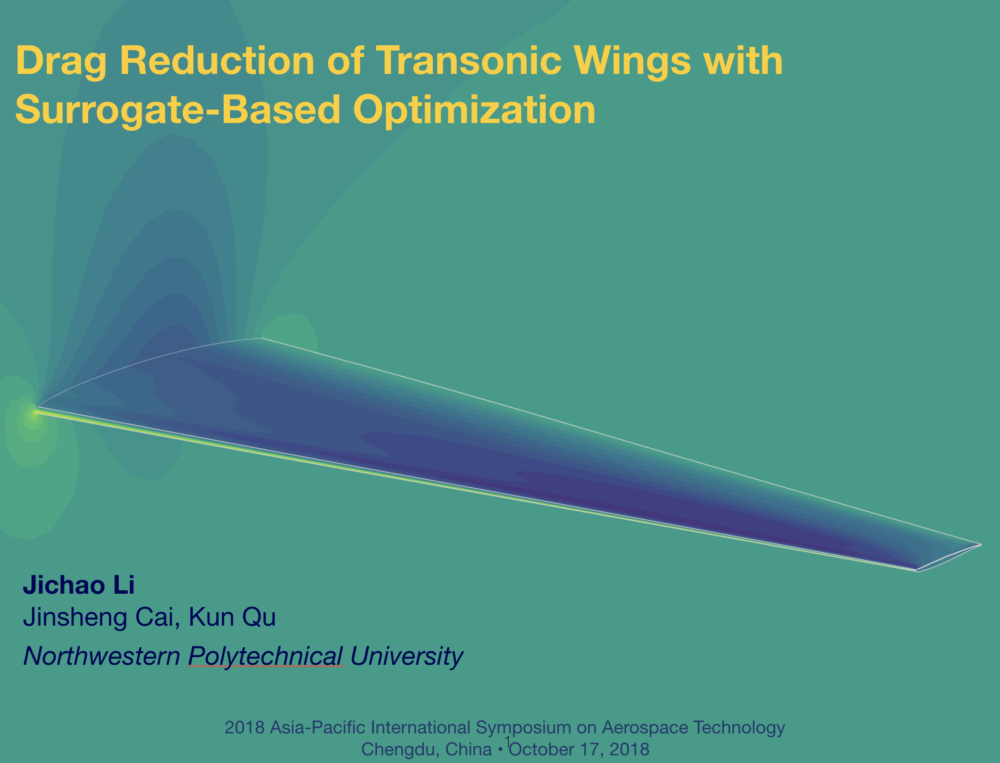 | __Jichao Li__, Jinsheng Cai, Kun Qu.     [__Drag Reduction of Transonic Wings with Surrogate-Based Optimization__](https://www.researchgate.net/publication/333665020_Drag_Reduction_of_Transonic_Wings_with_Surrogate-Based_Optimization)     _APISAT_ (2018)|
| 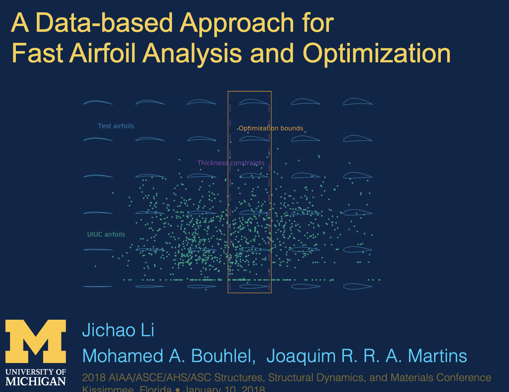 | __Jichao Li__, Mohamed A. Bouhlel, Joaquim R. R. A. Martins.     [__A Data-Based Approach for Fast Airfoil Analysis and Optimization__](https://www.researchgate.net/publication/322869846_A_Data-based_Approach_for_Fast_Airfoil_Analysis_and_Optimization)     _SciTech_ (2018)|
| 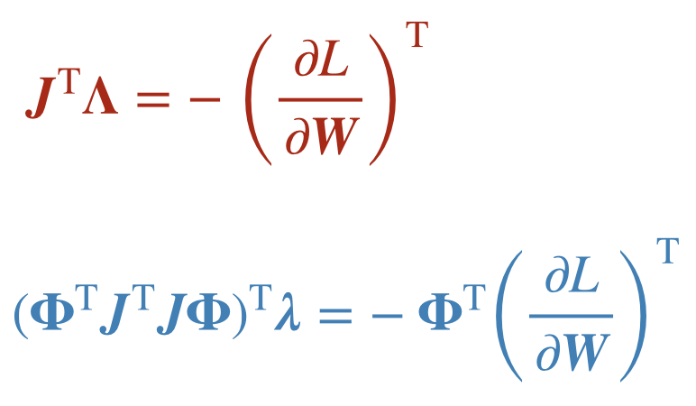 | __Jichao Li__, Kun Qu, Jinsheng Cai, Changqiang Cao.    [__Adjoint Approach based on Reduced-order Model for Steady PDE Systems__](https://www.researchgate.net/publication/303902969_Adjoint_Approach_based_on_Reduced-order_Model_for_Steady_PDE_Systems)     _SciTech_ (2018)|