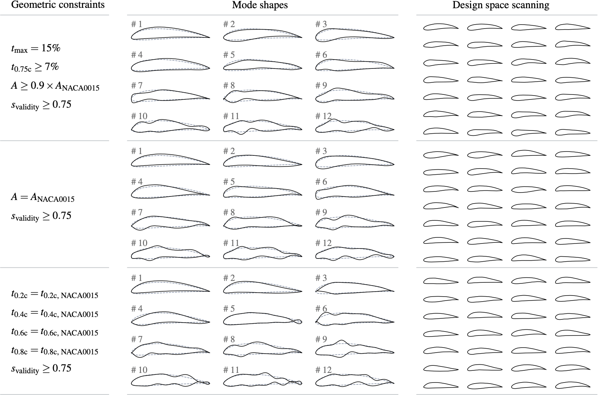
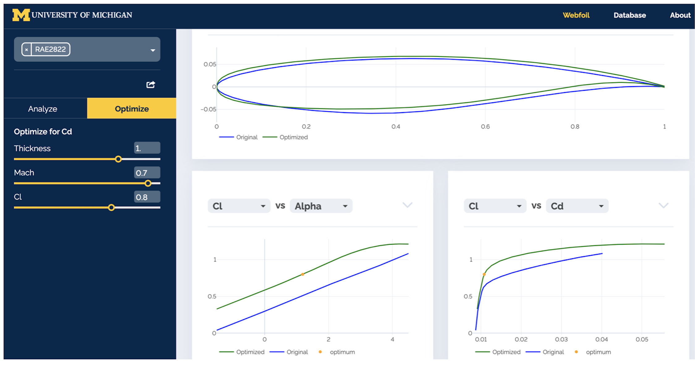

# Motivation

Aerodynamic shape optimization of 3D geometries can bring significant economic and environmental benefits, and using the adjoint method, it seems we can efficiently do this with CFD-based optimization. However, there are still some challenges for industrial applications calling for effective solutions, which are summarized as follows:
- Robust design optimization considering uncertainties
- Multi-objective design optimization
- Design optimization with discontinuous objective/constraint functions
- Interactive design optimization

The fundamental difficulties behind these challenges are two-fold: **high-dimensionality** and **high computational cost**. My research is to solve these difficulties so that we can perform practical aerodynamic shape optimization subject to industrial demands.

# My research

## 1. Addressing the high-dimensionality issue

Conventional parameterization methods introduce hundreds of shape design variables to guarantee the optimal design is included within the design space. My research shows that the dimensionality is not necessarily to be high.

First, I find that the design space by conventional parameterization methods contain too many abnormal design candidates, which are useless to optimization but aggravate the curse of dimensionality. I manage to exclude these shapes by developing a generic geoemtric abnormality analysis model laveraging on deep learning and historical design.

Second, I propose an optimal sampling method to infill the meaningful part of the high-dimensional design space. 

Then, I reduce the dimensionality from from hundreds to tens by reformulating the feasible domain, and this introduce almost no safficitac on design optimization effecitveness. 

  

__Related publications:__

|        |  |
|   :-:    | -       |
|  | __Jichao Li__, Mengqi Zhang, Joaquim R. R. A. Martins, Chang Shu.     [__Efficient Aerodynamic Shape Optimization with Deep-Learning-Based Geometric Filtering__](https://www.researchgate.net/publication/342620657_Efficient_Aerodynamic_Shape_Optimization_with_Deep-Learning-Based_Geometric_Filtering)     _AIAA Journal_ (2020).|
|  | __Jichao Li__, Mengqi Zhang.     [__Adjoint-Free Aerodynamic Shape Optimization of the Common Research Model Wing__](https://www.researchgate.net/publication/348646137_Adjoint-Free_Aerodynamic_Shape_Optimization_of_the_Common_Research_Model_Wing)     _AIAA Journal_ (2021).|
|  | __Jichao Li__, Mengqi Zhang.     [__On deep-learning-based geometric filtering in aerodynamic shape optimization__](https://www.researchgate.net/publication/349656275_On_deep-learning-based_geometric_filtering_in_aerodynamic_shape_optimization)     _Aerospace Science and Technology_ (2021).|
|  | __Jichao Li__, Mengqi Zhang, Chien Ming Jonathan Tay, Ningyu Liu, Yongdong Cui, Siou Chye Chew, Boo Cheong Khoo.     [__Low-Reynolds-number Airfoil Design Optimization using Deep-learning-based Tailored Airfoil Modes__](https://www.researchgate.net/publication/357441176_Low-Reynolds-number_airfoil_design_optimization_using_deep-learning-based_tailored_airfoil_modes)     _Aerospace Science and Technology_ (2022).|

## 2. Addressing the high computational cost

### Data-based aerodynamic analysis of on-design performance

To realize high-fidelity and real-time aerodynamic analyses for interactive design, I develop data-based aerodynamic models that work for arbitrary airfoil and wing shapes. Compared with RANS, these data-based models can complete aerodynamic analysis and optimization in seconds, with an error of less than 1%. These studies would contribute to realizing digital twins in aircraft design.

 

__Related publications:__

|        |  |
|   :-:    | -       |
|  | __Jichao Li__, Mohamed A. Bouhlel, Joaquim R. R. A. Martins.     [__Data-Based Approach for Fast Airfoil Analysis and Optimization__](https://www.researchgate.net/publication/328713133_Data-Based_Approach_for_Fast_Airfoil_Analysis_and_Optimization)     _AIAA Journal_ (2019).|
|  | __Jichao Li__, Mohamed A. Bouhlel, Joaquim R. R. A. Martins.     [__A Data-Based Approach for Fast Airfoil Analysis and Optimization__](https://www.researchgate.net/publication/322869846_A_Data-based_Approach_for_Fast_Airfoil_Analysis_and_Optimization)     _AIAA SciTech_ (2018). |
|  | __Jichao Li__, Mengqi Zhang.     [__Data-based Approach for Wing Shape Design Optimization__](https://www.researchgate.net/publication/350161199_Data-based_approach_for_wing_shape_design_optimization)     _Aerospace Science and Technology_ (2021). |

### Physics-based data-driven modeling of off-design constraints

Numerical evaluation of off-design performance (such as stall and buffeting) generally calls for expensive unsteady high-fidelity simulations. Due to this issue, the industry still relies on cheap empirical formulas to impose constraints on these off-design performances, which may affect the improvement of on-design performance. 

 

Our studies find that using physics-based data-driven modeling is feasible to train generalizable and high-fidelity off-design constraints, at a cost of __$O(10^5)$ training data__. We also showed its effectiveness in modeling constraints of low-speed performance and transonic buffeting onset. Besides, we show that adding data-driven constraints is effective to train stable flow control policy.

__Related publications:__

|        |  |
|   :-:    | -       |
|  | __Jichao Li__, Sicheng He, Mengqi Zhang, Joaquim R. R. A. Martins, Boo Cheong Khoo.     [__Physics-Based Data-Driven Buffet-Onset Constraint for Aerodynamic Shape Optimization__](https://www.researchgate.net/publication/360621247_Physics-Based_Data-Driven_Buffet-Onset_Constraint_for_Aerodynamic_Shape_Optimization)     _AIAA Journal_ (2022).|
|  | __Jichao Li__, Mengqi Zhang.     [__Reinforcement-learning-based Control of Confined Cylinder Wakes with Stability Analyses__](https://www.researchgate.net/publication/357030368_Reinforcement-learning-based_control_of_confined_cylinder_wakes_with_stability_analyses)     _Journal of Fluid Mechanics_ (2022).|
|  | __Jichao Li__, Sicheng He, Joaquim R. R. A. Martins.     [__Data-driven Constraint Approach to Ensure Low-speed Performance in Transonic Aerodynamic Shape Optimization__](https://www.researchgate.net/publication/333761028_Data-driven_Constraint_Approach_to_Ensure_Low-speed_Performance_in_Transonic_Aerodynamic_Shape_Optimization)     _Aerospace Science and Technology_ (2019).|

### Improve simulation efficiency

Generating traning data is computational cost. To reduce this burden, we propose a domain-decomposition-based ROM and the corresponding adjoint method. Using this approach, the training cost can be reduced by 90%. 

__Related publications:__

|        |  |
|   :-:    | -       |
|  | __Jichao Li__, Jinsheng Cai, Kun Qu.     [__Adjoint-Based Two-Step Optimization Method Using Proper Orthogonal Decomposition and Domain Decomposition__](https://arc.aiaa.org/doi/10.2514/1.J055773)     _AIAA Journal_ (2018).|

### Discover physical mechanisms from simulation data

Adequate physical mechanisms are desried to improve generalizability of data-driven models. Unfortunately, in industrial applications without sufficient prior studies, there may be a lack of knowledge of such physical mechanisms.

 

Our recent work further shows that we can learn physics purly from flow data and then train generalizable models with no prior physical studies.

### Improve data efficiency

The performance of data-driven models is highly related to the quality of training data. We present an uneven sampling method to improve data efficiency. The philosophy is that, for data-driven models used in design optimization, sampling more training data in domains with good aerodynamic performance is more efficient than evenly sampling. We show that this approach can reduce the data volume by 95%.

 

## 3. Enabling easy-to-use aerodynamic shape optimization for the industry

 

We develop a hybrid aerodynamic shape optimization framework (called pyAeroEGO) to solve practical aerodynamic design problems for the industry. It has two outstanding highlights compared with other frameworks:
- High optimization efficiency in 3D shape design (not necessary to use adjoint but comparably efficient with adjoint-based optimization). This feature is realized by coupling the efficient modal parameterization with the Bayesian optimization paradigm, which enables the framework to use arbitrary CFD solvers such as ADflow, OpenFoam, and XFoil.
- Capability of efficiently handling massive real-world missions to robust design optimization. This feature is achieved by hybrid using adjoint, ROM, and gradient-based optimization algorithms. 